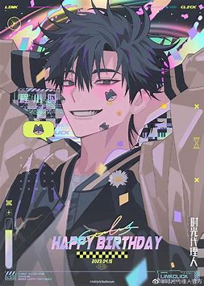

# 程小时

## 一、角色档案

- **身份**：时光照相馆的摄影师与老板
- **年龄**：21 岁
- **血型**：B 型
- **体重**：75kg
- **配音**：
  - 动画版：苏尚卿
  - 真人剧版：蒋龙（代表作《暗黑者2》《热血尖兵》）

## 人物关系

- 与乔苓情同姐弟
- 与陆光为生死搭档，三人形成 "时光代理人" 铁三角。

## 特殊能力

| 能力类型     | 具体描述                                                          |
| ------------ | ----------------------------------------------------------------- |
| **魂穿照片** | 能进入照片并附身照片中的拍摄者，经历拍摄时刻的事件和情绪。        |
| **限制条件** | 程小时无法自行控制离开时机，需搭档陆光配合与协调。               |
| **能力互补** | 搭档陆光能预见照片拍摄后12小时发生的未来事件。                   |

## 背景故事

程小时和陆光共同经营一家叫做“时光照相馆”的小店。表面上，这里只是一家普通的照相馆，背后却隐藏着特殊业务——两人利用能力穿梭过去，完成委托人的心愿。

程小时性格开朗热情，但时常冲动。他和搭档陆光拥有截然不同的能力，程小时负责行动，而陆光则负责观察、决策。两人配合默契，却也常在任务中遇到意料之外的挑战，面对复杂人性和难以预料的危险。

## 性格分析

### 核心特质

- ✅ **热血正义**：常因同情心而试图改变既定命运。
- ❌ **冲动鲁莽**：不考虑后果的行动，有时会造成严重后果。

### 人物成长弧线

1. **故事初期**  
   频繁擅自改变过去，带来了严重的连锁反应，如“艾玛事件”引发的危机。

2. **中期转变**  
   经历过惨痛的教训（如陆光受伤）后，开始审慎行动。

3. **故事后期**  
   成长为更加稳重和负责任的角色，明白了命运的重量与生命的意义。

## 结语

程小时的成长不仅贯穿了《时光代理人》的整个故事，更让我们体会到：尽管生命充满遗憾，但勇敢面对并珍惜当下，才是最有意义的事情。

  
  

