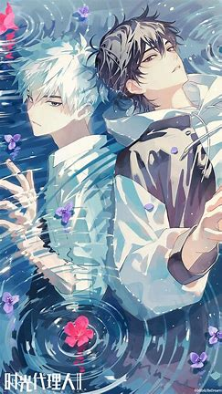
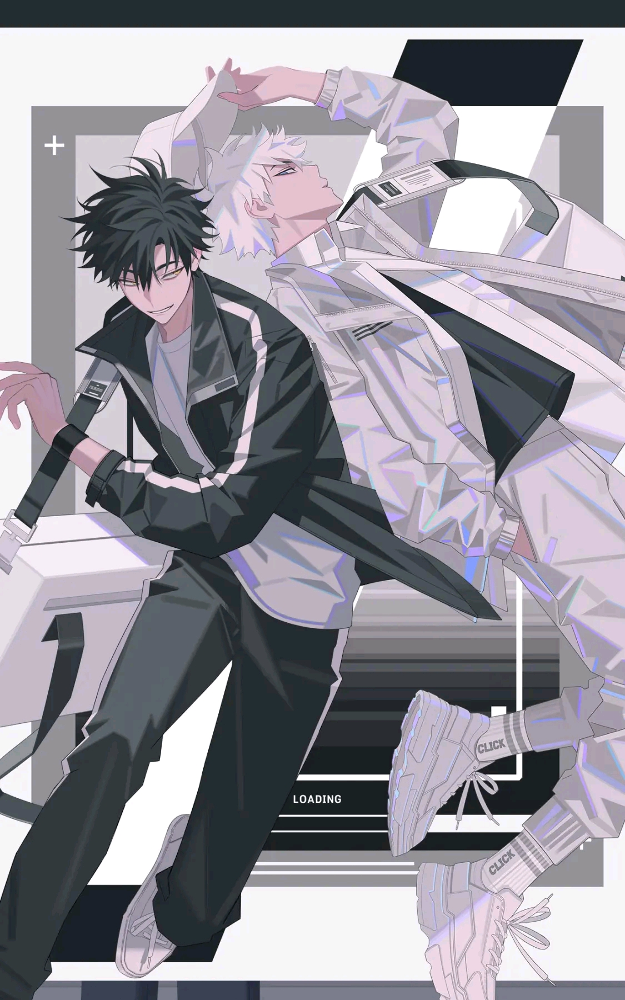
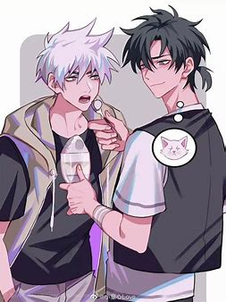

# 程小时与陆光：光影交织的时空羁绊

## 一、基础关系定位
| 维度         | 具体表现                                                                 |
| ------------ | ----------------------------------------------------------------------- |
| **官方设定** | 时光照相馆合伙人，共同执行"时光代理人"计划（动画/真人剧双版本确认）:cite[1]:cite[6] |
| **能力互补** | 程小时（魂穿照片）与陆光（预知未来）构成"执行-决策"闭环系统:cite[5]:cite[6] |
| **情感层次** | 超越常规友情的灵魂共鸣，被观众解读为"双男主"叙事范本:cite[4]:cite[5] |

## 二、关系演进轨迹
### 1. 初遇阶段
- **戏剧性开端**：程小时经营照相馆时偶遇神秘青年陆光，因超能力共鸣开启合作:cite[7]
- **权力博弈**：陆光制定"不问过去/将来"规则，程小时初期频繁违规试探边界:cite[8]

### 2. 信任建立
- **生死考验**：在工厂坠楼事件中，陆光为修正程小时的错误操作险些丧命:cite[5]
- **身份揭秘**：英都篇暗示陆光或为未来时空穿越者，掌握程小时父亲失踪线索:cite[3]

### 3. 终极联结
- **命运共享**：剧版新增"意识同步"设定，两人可共享五感但承受双倍痛觉:cite[3]
- **时空悖论**：粉丝解析ED画面中陆光穿着程小时的鞋子，暗示本体同一性假说:cite[8]

## 三、特殊关系符号解析
### 1. 视觉隐喻
- **色彩对照**：程小时（暖橙）象征热血与生命，陆光（冷蓝）代表理性与秩序:cite[8]
- **构图深意**：OP中两人各占画面半边，交界处形成DNA双螺旋结构:cite[8]

### 2. 台词密码
> "我们只是时间的代理人，不是上帝。" —— 陆光:cite[5]  
> *暗示其对程小时改变历史冲动的制衡*

> "如果代价必须存在，就让我成为那个代价。" —— 陆光:cite[3]  
> *预示英都篇中将为程小时承受时空反噬*

### 3. 动作语言
- **击掌契约**：每次任务前仪式性动作，实质是能力连接的能量通道:cite[6]
- **镜像站位**：危机时刻总以背靠背姿态迎敌，形成攻守兼备的"绝对领域":cite[5]

## 四、多维度关系解读
### 1. 叙事功能层
- **剧情引擎**：性格冲突推动案件发展（如程小时擅自拯救自杀者引发蝴蝶效应）:cite[5]
- **悬念载体**：陆光身份之谜贯穿全剧（穿越者/未来体/精神分身等推测）:cite[8]

### 2. 文化象征层
- **阴阳平衡**：东方哲学中"动与静""情与理"的具象化体现:cite[5]
- **时代隐喻**：Z世代"孤独共鸣"现象的艺术投射，展现数字时代的灵魂羁绊:cite[8]

### 3. 创作突破层
- **去CP化叙事**：官方刻意模糊情感边界，开创国漫双男主关系新范式:cite[1]:cite[4]
- **元宇宙预演**：通过意识连接设定，探讨虚拟与现实的身份认同问题:cite[3]

## 五、未来关系走向预测
1. **身份揭晓**：英都篇或将证实陆光与程氏家族的时空纠葛:cite[3]
2. **能力进化**：预告显示两人可实现"双重附身"，突破12小时限制:cite[3]
3. **代价显现**：频繁时空干预可能导致记忆融合或人格湮灭:cite[8]

---

**结语**  
程小时与陆光的关系早已超越常规伙伴定义，成为承载时空哲学与人性思辨的叙事载体。正如剧中不断强调的"光影相生"，他们的羁绊既是推动剧情发展的齿轮，也是照见观众情感镜像的棱镜。在即将到来的英都篇中，这段关系或将迎来震撼性突破——毕竟在时间的洪流里，没有比共同对抗命运更深刻的联结。

  
*光影交织处，即是永恒* 