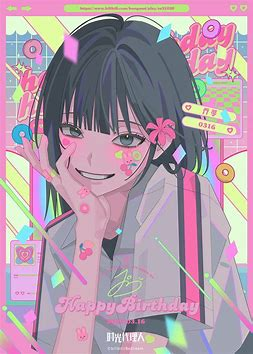
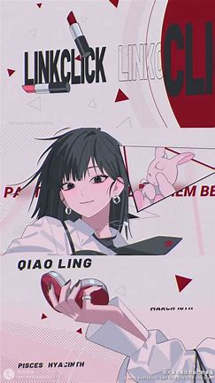
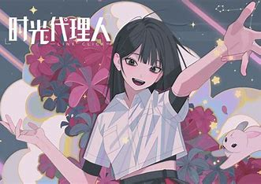
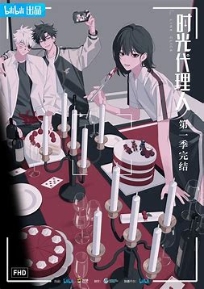

# 乔苓

## 一、角色档案:cite[2]:cite[5]:cite[6]
- **身份**：时光照相馆房东/委托中介人  
- **年龄**：未公开（推测与程小时相仿）  
- **职业拓展**：剧版新增“苓听TA说”节目主持人（深度参与社会事件评论）:cite[3]  
- **饰演者**：  
  - 动画版：李诗萌（中文）、古贺葵（日文）  
  - 真人剧版：卜冠今（代表作《驴得水》《消失的嫌疑人》）:cite[7]  

## 人物关系
- **与程小时**：青梅竹马，童年玩伴兼家人（程小时被其家庭收养）:cite[5]:cite[8]  
- **与陆光**：团队战略伙伴，维系"时光代理人"铁三角的情感纽带:cite[2]  
- **社会联结**：通过节目与观众互动，成为超能力团队与现实世界的桥梁:cite[3]  

## 核心定位
| 维度         | 具体描述                                                                 |
| ------------ | ----------------------------------------------------------------------- |
| **团队角色** | 委托任务中介者，负责筛选案件并平衡程小时的冲动与陆光的理性:cite[2]:cite[6] |
| **情感中枢** | 用普通人视角见证时空穿梭的代价，常以温暖化解团队矛盾:cite[5]:cite[8]       |
| **现实隐喻** | 剧版强化其职场女性形象，映射现代女性独立精神与社会责任感:cite[3]               |

## 背景故事
作为时光照相馆的房东之女，乔苓自幼与孤儿程小时共同成长，父母失踪后主动承担起照照相馆运营责任。在发现程小时与陆光的超能力后，她以中介身份为照相馆承接委托，通过节目主持人的职业身份深度介入社会事件调查（如职场性骚扰、网络暴力等）:cite[3]:cite[5]。  

**关键成长节点**：  
1. **初期**：单纯的任务中介者 → **案例**：机械传递委托导致程小时陷入危险  
2. **中期**：主动参与案件 → **转折点**：在“伪钞案”中独立调查线索  
3. **后期**：成为团队决策者 → **标志事件**：主持节目揭露黑心企业内幕:cite[3]  

## 性格分析
### 核心特质:cite[3]:cite[4]:cite[8]
- 🌟 **坚韧果敢**：面对职场不公时公开揭露真相（剧版新增职场篇）  
- 💬 **沟通大师**：巧妙化解程小时与委托人的冲突，如地震篇安抚陈潇  
- ⚖️ **道德标杆**：坚持"只帮助真正需要的人"的委托筛选原则  

### 矛盾性
- **理性与感性的撕扯**：  
  - 明知改变过去的风险，仍为程小时破例接受高风险委托  
  - 在"地震篇"中隐瞒部分真相保护程小时情绪:cite[3]  

## 文化象征
- **现实关怀化身**：通过主持职业探讨女性权益、职场歧视等社会议题:cite[3]  
- **平凡英雄代表**：以普通人之躯参与超自然事件，凸显"善意即超能力"的主题:cite[6]  
- **情感锚点**：平衡时空穿梭的奇幻感与人间烟火气（如常备程小时爱吃的零食）:cite[8]  

---

**结语**  
乔苓不仅是串联超能力团队的关键齿轮，更是《时光代理人》现实主义的灵魂载体。她的成长轨迹从“旁观者”到“参与者”再到“引领者”，完美诠释了普通人如何在非凡事件中坚守人性光辉。正如剧中所言：“有些温暖，比超能力更能穿透时空。”  

  
